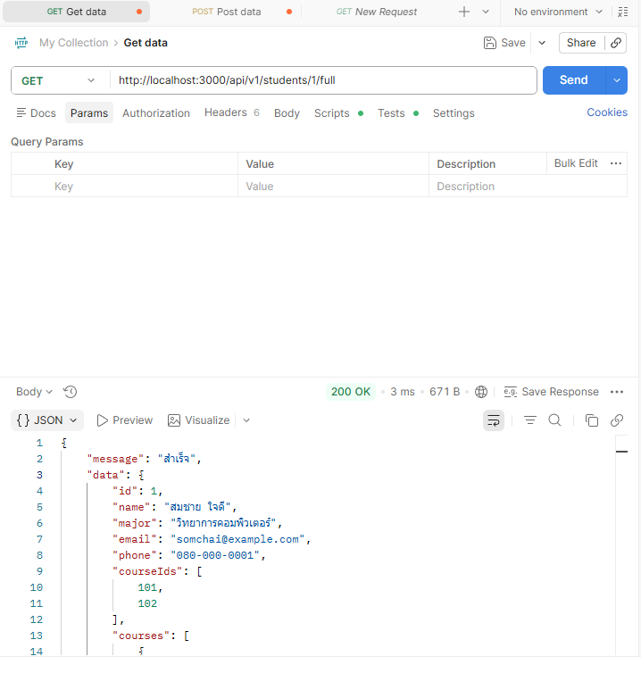
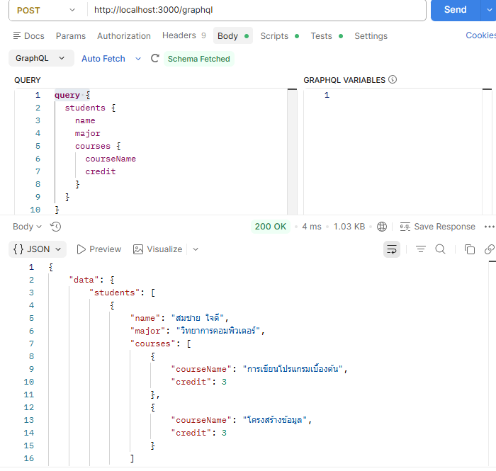
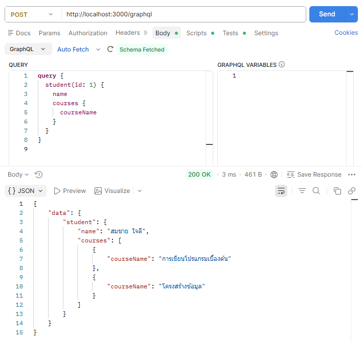
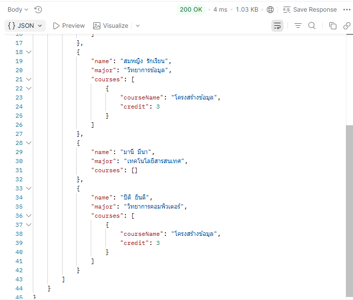

# สรุปการเปรียบเทียบ REST API และ GraphQL (สัปดาห์ที่ 2)

---

## ผลการทดลองเปรียบเทียบ

ภาพหน้าจอหรือบันทึกผลลัพธ์จาก

1. **REST endpoint `/api/v1/students/1/full` (แสดงปัญหา over-fetching)**

ทดสอบ `GET http://localhost:3000/api/v1/students/1/full` ด้วย Postman แล้วสังเกตผลลัพธ์

ผลลัพธ์ที่ได้รับ



- ข้อสังเกต (Over-fetching): สมมติว่าหน้าจอที่ต้องการแสดงผลต้องการเพียง `name` และรายชื่อ `courseName` เท่านั้น แต่ระบบ REST ข้างต้นคืนค่าฟิลด์อื่นที่ไม่จำเป็น เช่น email, phone, courseIds มาด้วยทุกครั้ง นี่คือปัญหา over-fetching ที่กล่าวถึงในเอกสารบรรยาย

2. **GraphQL Query ที่ขอเฉพาะ `name` และ `courses.courseName` (ขั้นตอนที่ 3.6 ใน wk02-lab.md)**

ในหน้า GraphiQL ทดลองพิมพ์ Query ต่อไปนี้ เพื่อขอเฉพาะ `name `และชื่อรายวิชา โดยไม่ขอฟิลด์อื่นที่ไม่จำเป็น

```graphql
query {
  student(id: 1) {
    name
    courses {
      courseName
    }
  }
}
```

ผลลัพธ์ที่ได้รับ


3. **GraphQL Query ที่รวมข้อมูลนักศึกษาทุกคนพร้อมรายวิชาในคำขอเดียว (ขั้นตอนที่ 3.7)**

ทดลอง Query ที่รวมข้อมูลจากหลาย resource ไว้ในคำขอเดียว

```query {
  students {
    name
    major
    courses {
      courseName
      credit
    }
  }
}
```




- เปรียบเทียบกับขั้นตอนที่ 2.4: สังเกตว่า Query เดียวนี้ให้ข้อมูลนักศึกษาทุกคนพร้อมรายวิชาที่ลงทะเบียนครบถ้วน โดยใช้เพียง 1 คำขอ ในขณะที่แนวทาง REST เดิมต้องใช้หลายคำขอเพื่อให้ได้ข้อมูลชุดเดียวกัน

---

## ตารางสรุปผลการเปรียบเทียบ

| หัวข้อเปรียบเทียบ                                                   | REST API (`/api/v1/students/:id/full`)                            | GraphQL (`/graphql`)                                               |
| :------------------------------------------------------------------ | :---------------------------------------------------------------- | :----------------------------------------------------------------- |
| **จำนวนคำขอ (Request) ที่ใช้เพื่อดูชื่อและรายวิชาของนักศึกษา 1 คน** | **1 คำขอ** (แต่เกิดปัญหา Over-fetching)                           | **1 คำขอ** (ได้รับเฉพาะฟิลด์ที่ต้องการ)                            |
| **จำนวนคำขอ (Request) ที่ใช้เพื่อดูชื่อและรายวิชาของนักศึกษาทุกคน** | **> 1 คำขอ** (หากต้องแยกดึงข้อมูลรายวิชา)                         | **1 คำขอ** (ใช้วิธี Nested Query รวมในคำขอเดียว)                   |
| **ฟิลด์ที่ได้รับเกินความจำเป็น (Over-fetching)**                    | **มี** (ได้รับ `email`, `phone`, `courseIds`, `credit` ติดมาด้วย) | **ไม่มี** (สามารถเลือกขอเฉพาะ `name` และ `courses.courseName` ได้) |
| **ขนาดของ Payload (Response Body Size)**                            | ใหญ่กว่า (~380 Bytes)                                             | เล็กกว่า (~140 Bytes)                                              |
| **การกำหนดโครงสร้างข้อมูลตอบกลับ**                                  | ฝั่ง Server เป็นผู้กำหนดโครงสร้างตายตัว                           | ฝั่ง Client เป็นผู้กำหนดโครงสร้างอิสระ                             |

---
